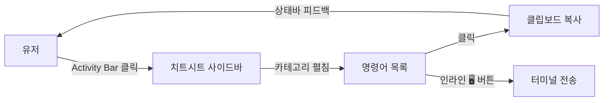
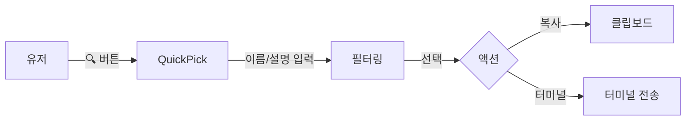
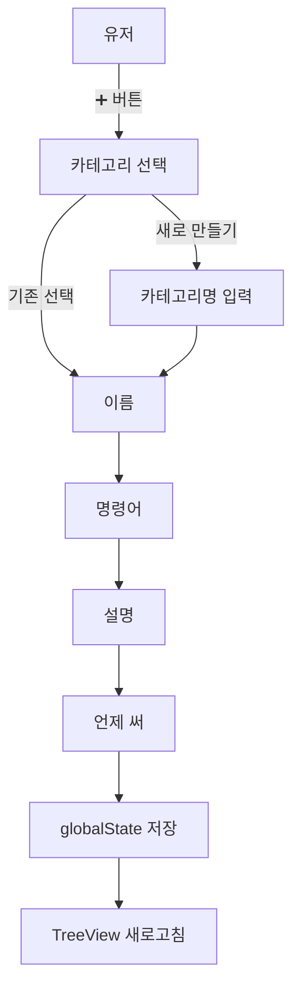
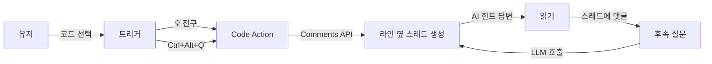

# DevNavi 설계 문서

> 이 문서는 DevNavi를 어떻게 시작했고, 어떤 원칙으로 설계했으며, 각 기능을 왜 그 방식으로 만들었는지 기록한다.
> 코드는 자주 바뀌지만 "왜 이렇게 만들었는가"는 이 문서에서 찾는다.

---

## 1. 프로젝트 시작

### 1.1 문제 인식 (Pain Point)
AI(Copilot/Cursor/Claude/GPT)가 코드를 뚝딱 짜주는 시대가 되면서 이런 현상이 생겼다.

- 작은 수정도 직접 못 하는 개발자가 늘고 있다
- "이 명령어가 뭐였지" 매번 구글링한다
- AI 의존도는 높아지는데 실력은 안 는다

핵심은 **"AI가 대신해주는 건 많은데, 내가 뭘 하고 있는지 모르는"** 상태.

### 1.2 제품 포지셔닝
```
AI 에이전트 (Claude/GPT/Gemini)   =  두뇌 🧠
  → 유저가 자기 API 키로 직접 연결

DevNavi                            =  효율적 껍데기 + 토큰 절약기 💡
  → 두뇌를 "최소 비용 / 최고 UX"로 전달
```

Copilot과 **경쟁이 아니라 공존**.
Copilot이 짜주면 → DevNavi가 "이게 뭐야" 알려주고 → 작은 건 유저가 직접 수정하게.

### 1.3 초기 기술 선택
- **모노레포** (`apps/extension` + `apps/web` + `packages/shared`)
  → Extension 메인, Web은 랜딩/대시보드 보조. 공통 타입은 shared로.
- **Extension scaffold**: `yo code` (TypeScript + webpack)
- **브랜치 전략**: `main`(배포) / `develop`(개발) / `feature/*`(기능별)
- **현재 브랜치**: `feature/cheatsheet`

---

## 2. 핵심 설계 원칙

코드 작성 시 항상 이걸 기준으로 판단한다.

| 원칙 | 의미 |
|---|---|
| **대신 해주는 게 아니라 할 수 있게** | 답을 주지 않고 힌트만 |
| **공존** | 어떤 AI와도 같이 쓸 수 있게 |
| **UX가 제품** | AI는 남의 것. 우리 무기는 보여주는 방식 |
| **조용한 도움** | 눈에 안 띄게 작동, 필요할 때만 등장 |
| **성장 유도** | 반복 질문 패턴을 보여줘서 스스로 깨닫게 |

**코드 품질 원칙** — 최적화 우선 / DRY / 불필요한 코드 금지 / 타입 안전성 / 최소 의존성 / 메모리 관리 / lazy loading / JSON은 1회 로드 후 메모리 캐시.

---

## 3. 아키텍처

### 3.1 레이어 구조
```
extension.ts              (진입점, 얇게 유지)
    ↓
providers/                (TreeDataProvider — 사이드바 UI 공급)
    ↓
commands/                 (유저 액션 플로우 — QuickPick, InputBox)
    ↓
storage/                  (globalState wrapper, SecretStorage wrapper 예정)
    ↓
utils/                    (clipboard, llm 예정, tokenTracker 예정)
    ↓
data/                     (번들 내장 JSON)
```

`extension.ts`는 **바인딩만** 한다. 비즈니스 로직은 위 레이어로 분리.

### 3.2 UI 전략
| 기능 | 방식 | 이유 |
|---|---|---|
| 치트시트 | **TreeView** | 가볍고 네이티브. 카테고리 펼치기/접기 자연스러움 |
| 프로젝트 네비 (예정) | **TreeView** | 체크박스 목록이 네이티브 TreeItem과 잘 맞음 |
| 코드 가이드 (예정) | **Comments API** | 코드 옆 인라인 스레드 — 뒤 7.1 참고 |
| 토큰 상세 패널 (예정) | **Webview** | 차트/테이블 필요 |

**Webview는 꼭 필요할 때만**. 남용 금지.

### 3.3 데이터 저장 정책
| 종류 | 저장 위치 | 비고 |
|---|---|---|
| 기본 치트시트 | `src/data/cheatsheet.json` | webpack 번들 내장 (import) |
| 커스텀 명령어 | `globalState` | key: `devnavi.customCommands` |
| 프로젝트 진행 상황 (예정) | `globalState` | 다시 열어도 유지 |
| 토큰 기록 (예정) | `globalState` | 조용히 축적 |
| 유저 API 키 (예정) | **SecretStorage** | 절대 globalState 금지 |

---

## 4. 현재까지 구현

### 4.1 Phase 1 — 치트시트 TreeView 골격
**파일**
- `providers/cheatsheetProvider.ts` — `TreeDataProvider<CheatNode>`
- `utils/clipboard.ts` — 복사 + 터미널 전송
- `resources/icon.svg` — Activity Bar 나침반 아이콘

**동작**
- Activity Bar 아이콘 클릭 → 치트시트 사이드바 열림
- 카테고리 펼치기 → 명령어 목록 (Git / 터미널 / npm)
- 명령어 클릭 = 클립보드 복사 + 상태바에 `✓ 복사됨` 피드백
- hover = 3줄 설명 (이게 뭐야 / 언제 써 / 예시 코드블록)
- inline 터미널 아이콘 = 터미널에 바로 주입 (엔터는 유저가)

### 4.3 Phase 3 — 코드 가이드 (Comments API + 더미)
**파일**
- `providers/codeGuideProvider.ts` — `CommentController` + `CodeActionProvider`

**동작**
- 코드 선택 → 세 경로 트리거: `Ctrl+.` 메뉴 · `Ctrl+Alt+Q`(설명) / `Ctrl+Alt+H`(힌트) · 우클릭
- 선택 라인 옆에 스레드 생성, 질문 말풍선 + 답변 말풍선 붙음
- 스레드 내 답글 입력으로 후속 질문 가능
- 선택 영역 비면 토스트로 안내

### 4.5 Phase 4.5 — 프롬프트 모드 분리 + 프로젝트 맵
**프롬프트 완화**: `explain`/`hint`/`reply` 3모드로 분리.
- `hint`에만 "답 금지" 강제
- `explain`은 쉬운 설명 + 힌트 포인트
- 후속 답글은 `reply` 모드 — 유저 질문에 **직접 답변** (힌트만 고집하지 않음)

**프로젝트 맵** (`providers/projectMapProvider.ts`):
- `FileDecorationProvider`로 Explorer의 폴더/파일에 뱃지 + 툴팁 주입
- 데이터는 워크스페이스 루트의 `.devnavi/projectMap.json` 로드 (있으면 적용, 없으면 no-op)
- `FileSystemWatcher`로 파일 변경 감지 → 자동 reload

### 4.4 Phase 4 — LLM 연결
**파일**
- `storage/apiKey.ts` — `SecretStorage` 래퍼 + configuration 읽기 헬퍼
- `commands/config.ts` — API 키 설정/삭제, 프로바이더 전환 UX
- `utils/llm.ts` — OpenAI/Claude/Gemini 공통 어댑터 (fetch 기반)
- `utils/prompts.ts` — "답 금지·힌트만" 시스템 프롬프트 + explain/hint 분기

**동작**
- 처음 코드 가이드 호출 시 API 키 없으면 에러 코멘트에 `[API 키 설정하기]` 링크 (command URI)
- 호출 중엔 `🧭 생각 중…` 로딩 코멘트 표시 → 응답 오면 그 자리에서 교체
- 후속 답글은 스레드 히스토리를 함께 넘겨 대화 맥락 유지
- 프로바이더/모델은 `settings.json`의 `devnavi.llm.provider`/`model`, API 키는 `SecretStorage`

**기본 모델**
- OpenAI `gpt-4o-mini` · Anthropic `claude-haiku-4-5-20251001` · Google `gemini-1.5-flash`
- 커스텀 모델은 `devnavi.llm.model` 설정으로 덮어쓰기

### 4.2 Phase 2 — 검색 + 커스텀 명령어
**파일 추가**
- `commands/search.ts` — QuickPick 검색
- `storage/customCommands.ts` — globalState CRUD
- `commands/customCommands.ts` — 추가/수정/삭제 플로우

**동작**
- 🔍 뷰 타이틀 검색: flat list → 이름·명령어·whenToUse 필터 → 선택 후 복사/터미널 선택
- ➕ 커스텀 추가: 카테고리 선택(기존 or 새로) → 이름 → 명령어 → 설명 → 언제 써
- 커스텀은 ⭐ 아이콘, 기본은 터미널 아이콘으로 구분
- 커스텀 우클릭 = 수정/삭제 메뉴. 기본 명령어엔 안 뜸 (`when: viewItem == command:custom`)

---

## 5. 작업 흐름도

### 시나리오 A — 치트시트 빠른 복사


### 시나리오 B — 검색


### 시나리오 C — 커스텀 추가


### 시나리오 D — 코드 가이드 (예정, Phase 3)


---

## 6. 특이사항 / 의사결정 기록

각 결정의 **"왜"** — 나중에 같은 고민 반복하지 않으려고 기록.

### 6.1 JSON을 번들에 내장 (import 방식)
- 처음엔 `fs.readFileSync(extensionPath + '/src/data/...')`로 갔음
- 문제: 배포 시 `.vscodeignore`에 src가 빠지면 파일 없음. 런타임 I/O 발생
- 변경: `import cheatsheetData from '../data/cheatsheet.json'` + tsconfig `resolveJsonModule`
- **효과**: webpack이 번들에 내장 → 경로 문제 사라지고 캐싱도 공짜 (모듈 1회 로드)

### 6.2 Activity Bar 아이콘은 SVG 파일 필수
- `viewsContainers.activitybar`의 `icon`은 codicon reference(`$(compass)`) 안 먹음
- `resources/icon.svg` 직접 작성 (간단한 나침반 형태)
- `views` 안쪽은 codicon 가능

### 6.3 CheatNode를 category/command 한 클래스로 통합
- 처음엔 분리도 고민 (상속 2종). 하지만 TreeDataProvider 흐름상 분기 1곳이면 충분
- `kind: 'category' | 'command'` 판별자로 처리 → 타입 안전 + 구조 단순

### 6.4 contextValue 네임스페이싱: `command:builtin` / `command:custom`
- when 절에서 `viewItem == command:custom`으로 커스텀에만 수정/삭제 메뉴 노출
- 인라인 버튼은 `viewItem =~ /^command/` 정규식으로 둘 다 매칭 (터미널 전송은 공통)
- 확장성: 나중에 `command:favorite` 등 추가해도 when 절만 수정

### 6.5 유저가 새 카테고리 만들 수 있게
- QuickPick에 "$(add) 새 카테고리 만들기" 항목 포함
- 대소문자 구분 유지 (`Git` ≠ `git`). 정규화 안 함 — 유저 입력 존중

### 6.6 커스텀 수정/삭제는 우클릭 메뉴만
- inline 버튼 과잉 방지 (치트시트는 "읽고 복사"가 주 동작)
- 수정·삭제는 빈도 낮으니 우클릭으로 숨김

### 6.7 코드 가이드는 Comments API로 결정
- **후보**:
  - A. Code Action + Hover popup → 대화 불가
  - B. **Comments API (선택)** → 네이티브 인라인 스레드, 후속 질문 가능
  - C. Webview panel beside → "별도 창" 느낌, 철학과 어긋남
  - D. Inline Chat (proposed API) → 안정성 리스크
- **선택 이유**:
  - 코드 옆에 스레드가 살아있음 → CLAUDE.md "별도 창이 아니라 코드 맥락 안" 충족
  - 한 코드에 여러 번 물어본 히스토리가 그 자리에 남음 → 맥락 복원
  - VSCode 네이티브 패턴 — 학습 비용 0

### 6.8 LLM 어댑터는 SDK 없이 fetch로
- 후보: `openai`/`@anthropic-ai/sdk`/`@google/generative-ai` 각 SDK
- 선택: 모두 기각. Node 20+ 전역 `fetch` + 직접 REST 호출
- 이유: "최소한의 의존성" 원칙 · 번들 사이즈 · 세 프로바이더 공통 추상을 우리가 소유
- 각 어댑터는 `LLMMessage[]` → 공급자별 포맷 변환만. Claude는 system 분리, Gemini는 `contents+systemInstruction`, OpenAI는 messages 통합.

### 6.9 로딩 → 응답 교체는 객체 identity로
- `thread.comments`는 readonly array. 추가는 `[...prev, new]` 교체 뿐
- 로딩 코멘트 객체 참조를 잡아두고 `list.map(c => c === target ? next : c)`로 치환
- 플래그/UUID 없이 identity만으로 충분 — 메모리/GC 공짜

### 6.10 API 키는 반드시 SecretStorage
- `globalState`는 평문 저장 — 키 같은 비밀은 절대 금지
- `vscode.ExtensionContext.secrets` 사용, 프로바이더별 키 분리 (`devnavi.apiKey.openai` 등)
- 유저 전환 시 다른 프로바이더 키도 유지

### 6.11 스레드 맥락은 WeakMap에 저장
- `CommentThread`에 메타데이터 필드 없음 → 별도 저장소 필요
- `WeakMap<CommentThread, ThreadState>` — 스레드가 수명 다하면 자동 GC. 누수 없음
- 첫 질문의 `kind/code/language/initialQuestion` 기억 → 답글 시 동일한 시스템 프롬프트/코드 블록 재사용

### 6.12 프롬프트 "답 금지"는 `hint` 모드에만
- 초안: 모든 턴에 "답 금지·힌트만" 강제 → 후속 질문 시 답답함
- 변경: 모드 분리 (`explain`/`hint`/`reply`)
- `reply`에는 "이 답글 턴부턴 직접 답 OK" 오버라이드 명시 — 초기 시스템 룰을 턴 단위로 풀어줌
- 결과: **배우고 싶을 땐 힌트**, **궁금할 땐 직답** 둘 다 가능

### 6.13 프로젝트 맵은 FileDecorationProvider로
- 후보:
  - A. 별도 TreeView "프로젝트 맵" → 또 하나의 창, 맥락 멀어짐
  - B. **FileDecorationProvider (선택)** → Explorer 그 자리에 뱃지+툴팁
  - C. Hover/CodeLens → 코드 안에서만 동작, Explorer 안 됨
- 선택 이유: 유저가 이미 Explorer를 보고 있을 때 정보가 거기 있어야 가장 자연스러움
- 데이터 경계: 워크스페이스별 `.devnavi/projectMap.json` → 일반 프로젝트에도 그대로 적용 가능 (DevNavi 자체만 위한 것 아님)
- 배지는 ≤2자 제약 — 이모지 1자 또는 알파벳 1-2자. 자세한 설명은 tooltip에.

### 6.14 Extension 진입점은 얇게
- `extension.ts`는 인스턴스 생성 + 커맨드 바인딩만
- 로직은 `providers`/`commands`/`storage` 레이어로. 테스트 용이, 번들 tree-shaking 유리

---

## 7. 다음 단계 로드맵

### 7.1 Phase 3 — 코드 가이드 (Comments API)
1. `providers/codeGuideProvider.ts` — `CommentController` 생성
2. Code Action (`CodeActionProvider`) + 단축키 `Ctrl+Alt+Q` 로 트리거
3. 선택 영역에 `CommentThread` 생성 → 라인 하이라이트
4. 첫 답변은 **더미** (LLM 연결 전 UI 골격 먼저)
5. 스레드 내 후속 질문 → `CommentController.commentingRangeProvider`

### 7.2 Phase 4 — LLM 연결
- `utils/llm.ts` — OpenAI / Claude / Gemini 어댑터
- `SecretStorage`에서 API 키 읽기
- 프롬프트: "답을 주지 말고 힌트만. 어디가 뭔지 / 왜 그런지 / 다음에 뭘 볼지"
- 스마트 캐싱 (같은/비슷한 질문)

### 7.3 Phase 5 — 토큰 절약 시스템
- `utils/tokenTracker.ts` — 조용히 누적
- 상태바 작은 아이콘 `🪙 3회 절약`
- 클릭 시 상세 패널 (Webview): 토큰 사용량 / 캐시 절약 / **반복 질문 TOP 5** / 모델별 비용 비교

### 7.4 Phase 6 — 프로젝트 네비게이터
- TreeView + AI 로드맵 생성
- 체크박스 목록, Phase별 진행률
- 상태바에 `Phase 2/4 · 5/12 완료`
- globalState에 진행 상황 저장

### 7.5 Phase 7 — 웹 대시보드 & 배포
- Next.js + Supabase (랜딩, 유저 대시보드)
- VSCode Marketplace 배포

---

## 8. 현재 폴더 트리

```
devnavi/
├── apps/
│   ├── extension/
│   │   ├── src/
│   │   │   ├── extension.ts                   # 진입점 (얇게)
│   │   │   ├── providers/
│   │   │   │   ├── cheatsheetProvider.ts      # 치트시트 TreeView
│   │   │   │   └── codeGuideProvider.ts      # 코드 가이드 Comments API
│   │   │   ├── commands/
│   │   │   │   ├── customCommands.ts          # 치트시트 커스텀 CRUD 플로우
│   │   │   │   ├── search.ts                  # QuickPick 검색
│   │   │   │   └── config.ts                  # API 키/프로바이더 설정 UX
│   │   │   ├── storage/
│   │   │   │   ├── customCommands.ts          # globalState CRUD
│   │   │   │   └── apiKey.ts                  # SecretStorage + 설정 헬퍼
│   │   │   ├── utils/
│   │   │   │   ├── clipboard.ts               # 복사 + 터미널 전송
│   │   │   │   ├── llm.ts                     # OpenAI/Claude/Gemini 어댑터
│   │   │   │   └── prompts.ts                 # 시스템 프롬프트 빌더
│   │   │   └── data/
│   │   │       └── cheatsheet.json            # 기본 명령어 데이터
│   │   ├── resources/icon.svg                 # Activity Bar 아이콘
│   │   ├── package.json
│   │   ├── tsconfig.json
│   │   └── webpack.config.js
│   └── web/                                   # (예정)
├── packages/shared/                           # (예정)
├── docs/
│   └── DESIGN.md                              # 이 문서
├── CLAUDE.md                                  # 프로젝트 컨텍스트
└── package.json                               # 모노레포 루트
```

---

## 9. 문서 업데이트 규칙

- 새 Phase 시작 전 — 해당 섹션에 **설계 의도** 먼저 기록
- 의사결정이 있으면 — §6에 **"왜"** 추가
- 기능 완성 후 — §4에 구현 요약 + §5에 흐름도 추가
- 코드가 바뀌면 폴더 트리(§8) 갱신
